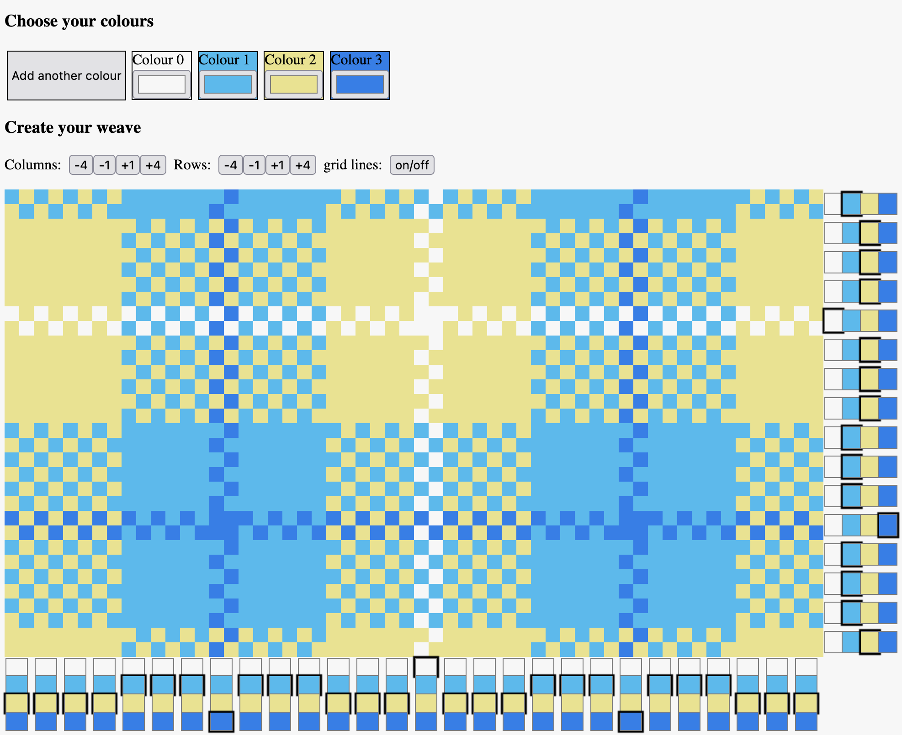

HueGo Weaving
=============

A dead-simple React app for designing plain weaving patterns.

Used as a project to practice building UI with React, and for my partner to
design weaving patterns.

Usage
-----

Instructions:

1. Navigate to [huego.far.in.net](http://huego.far.in.net).
2. Create and modify colourscheme using top buttons.
3. Resize grid to satisfaction.
4. Set colours for each column and row using selectors at ends of columns and
   rows.

Example design:



Testimonials:

> I really like it. I think it's really cool, but I don't know how to review
> it. You can put words in my mouth, that's fine. Make it glowing. Cos I
> really really like it.
> 
> ---A user.

Development
-----------

Requirements:

1. make
2. swc

Instructions:

1. Work in `src/`.
2. Build with `make` from root directory
3. Browse to `dev/index.html`

Deployment (GitHub pages)
----------

Requirements:

1. A GitHub Account
2. A repository 

Instructions:

1. Create a subrepo (`ghp` folder) and configure GitHub pages using the
   GitHub website
2. Build the app and copy `dev/` contents into `ghp/`
3. Replace the react library imports in `ghp/index.html` with the following:

   ```
   <script src="https://unpkg.com/react@18.2.0/umd/react.production.min.js" crossorigin></script>
   <script src="https://unpkg.com/react-dom@18.2.0/umd/react-dom.production.min.js" crossorigin></script>
   ```

3. Commit and push the subrepo.

Alternatives:

* Whatever static website hosting you like.

Roadmap
-------

Proof of concept:

* [x] display the checkered grid
* [x] change the colour of each row/column
* [x] dynamic colors
* [x] dynamic grid

First round of user testing and feedback

* [x] decrease number of rows/columns
* [x] click and drag to set colours on columns/rows

Moving forward:

* [ ] persist designs (through URL?)
* [ ] review and improve codebase
